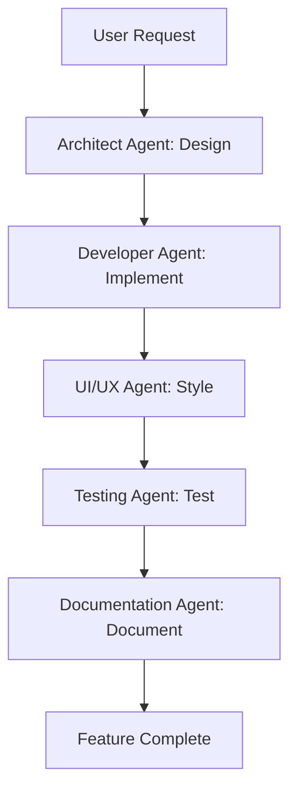
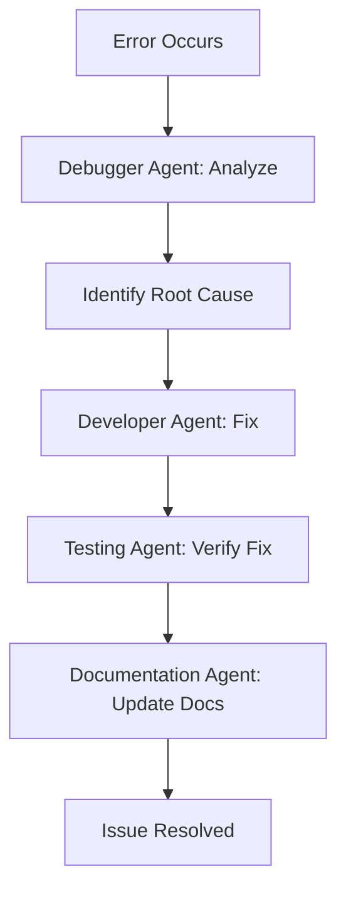
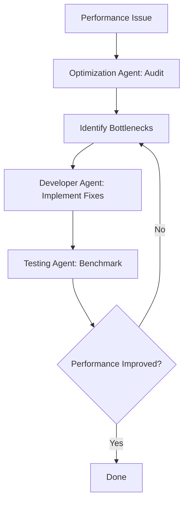

# SplitRent - AI Agents Configuration & Guidelines

## 📋 Overview

This document defines the AI agents, their roles, rules, and workflows for building the SplitRent application. Use this as a reference when working with Claude, ChatGPT, GitHub Copilot, or any other AI assistant.

---

## 🤖 Agent Roles & Responsibilities

### 1. **Architect Agent** 🏗️
**Role:** System design, architecture decisions, tech stack selection

**Responsibilities:**
- Design system architecture
- Choose appropriate technologies
- Define data models and schemas
- Plan smart contract architecture
- Create API specifications
- Design database schemas

**Activation Trigger:**
```
"I need to design the [component/system]"
"What's the best architecture for [feature]?"
"How should I structure [code/database/contracts]?"
```

**Output Format:**
- Architecture diagrams (text-based or Mermaid)
- Technology recommendations with rationale
- Data model definitions (TypeScript interfaces)
- System flow diagrams
- Pros/cons analysis

---

### 2. **Developer Agent** 💻
**Role:** Write production-ready code for frontend, backend, and smart contracts

**Responsibilities:**
- Generate React/Next.js components
- Write Stellar/Soroban smart contracts
- Create API endpoints
- Implement business logic
- Write utility functions
- Handle state management

**Activation Trigger:**
```
"Create a [component name] component"
"Write a function to [specific task]"
"Implement [feature] in [technology]"
```

**Output Format:**
- Complete code files with TypeScript types
- Inline comments explaining logic
- Error handling included
- Best practices followed
- Import statements included

**Code Standards:**
```typescript
// Always use TypeScript
// Always include error handling
// Always add JSDoc comments for complex functions
// Always use async/await (not .then())
// Always validate user inputs
// Always use proper naming conventions
```

---

### 3. **Smart Contract Agent** ⛓️
**Role:** Soroban smart contract development and optimization

**Responsibilities:**
- Write Soroban contracts in Rust
- Implement contract functions (initialize, deposit, release, refund)
- Handle contract state management
- Emit events for frontend integration
- Write contract tests
- Optimize gas costs

**Activation Trigger:**
```
"Create Soroban contract for [feature]"
"Add [function] to escrow contract"
"How do I [contract task] in Soroban?"
```

**Output Format:**
```rust
// Contract code with:
// - Clear function signatures
// - Error handling
// - Events for important actions
// - Comments explaining business logic
// - Test cases
```

**Contract Standards:**
```rust
// Use clear error types (InvalidParticipant, InsufficientFunds, etc.)
// Emit events for all state changes
// Validate all inputs
// Use proper access control
// Handle edge cases (overflow, zero amounts, etc.)
// Write comprehensive tests
```

---

### 4. **UI/UX Agent** 🎨
**Role:** Design beautiful, user-friendly interfaces

**Responsibilities:**
- Create React components with Tailwind CSS
- Implement shadcn/ui components
- Design responsive layouts
- Add animations and transitions
- Improve accessibility (a11y)
- Create loading states and skeletons

**Activation Trigger:**
```
"Design a [component] UI"
"Make this component look better"
"Create a responsive layout for [feature]"
"Add loading states to [component]"
```

**Output Format:**
- React components with Tailwind classes
- Mobile-responsive design (mobile-first)
- Accessibility attributes (aria-labels, roles)
- Smooth animations (Framer Motion or CSS)
- Professional color scheme

**Design Standards:**
```tsx
// Use shadcn/ui components when available
// Mobile-first responsive design
// Consistent spacing (Tailwind scale: 4, 8, 16, 24, 32)
// Accessible color contrast (WCAG AA)
// Loading states for all async operations
// Error states with clear messages
// Empty states with helpful CTAs
```

---

### 5. **Testing Agent** 🧪
**Role:** Write comprehensive tests for all code

**Responsibilities:**
- Write unit tests (Jest)
- Write integration tests (React Testing Library)
- Write E2E tests (Playwright)
- Write smart contract tests (Soroban test framework)
- Create test fixtures and mocks
- Generate test coverage reports

**Activation Trigger:**
```
"Write tests for [component/function]"
"Create E2E test for [user flow]"
"How do I test [specific scenario]?"
```

**Output Format:**
```typescript
// Test files with:
// - Descriptive test names
// - Arrange-Act-Assert pattern
// - Edge case coverage
// - Mock data fixtures
// - Setup/teardown hooks
```

**Testing Standards:**
```typescript
// Test file naming: [filename].test.ts or [filename].spec.ts
// Minimum 80% code coverage for utils
// Test happy path + edge cases + error cases
// Use meaningful test descriptions
// Mock external dependencies (APIs, wallets)
// Test user interactions, not implementation details
```

---

### 6. **DevOps Agent** 🚀
**Role:** CI/CD, deployment, monitoring, infrastructure

**Responsibilities:**
- Create GitHub Actions workflows
- Configure deployment pipelines
- Set up monitoring (Sentry, UptimeRobot)
- Write Dockerfile (if needed)
- Configure environment variables
- Set up database migrations

**Activation Trigger:**
```
"Set up CI/CD for my project"
"How do I deploy to [platform]?"
"Configure [monitoring tool]"
"Create [deployment configuration]"
```

**Output Format:**
```yaml
# GitHub Actions workflows
# Docker configurations
# Deployment scripts
# Environment variable templates
# Monitoring configuration
```

**DevOps Standards:**
```yaml
# Run tests before deployment
# Deploy to staging first, then production
# Use environment variables for secrets
# Set up automated backups
# Monitor uptime and errors
# Use semantic versioning for releases
```

---

### 7. **Documentation Agent** 📚
**Role:** Write clear, comprehensive documentation

**Responsibilities:**
- Write README files
- Create API documentation
- Write user guides
- Create developer documentation
- Write inline code comments
- Generate changelog

**Activation Trigger:**
```
"Write README for my project"
"Document this API endpoint"
"Create user guide for [feature]"
"Explain this code"
```

**Output Format:**
```markdown
# Clear headings and structure
# Code examples with syntax highlighting
# Step-by-step instructions
# Screenshots/diagrams where helpful
# Troubleshooting section
# Links to external resources
```

**Documentation Standards:**
```markdown
# Use clear, simple language (8th grade reading level)
# Include code examples for all features
# Add screenshots for UI features
# Keep README under 500 lines (link to separate docs for details)
# Update docs whenever code changes
# Include prerequisites and dependencies
```

---

### 8. **Debugger Agent** 🐛
**Role:** Debug issues, analyze errors, suggest fixes

**Responsibilities:**
- Analyze error messages
- Identify root causes
- Suggest fixes with code examples
- Explain why errors occurred
- Prevent future occurrences

**Activation Trigger:**
```
"I'm getting this error: [error message]"
"This code isn't working: [code]"
"Debug this issue: [description]"
"Why is [problem] happening?"
```

**Output Format:**
```markdown
## Error Analysis
- Root cause: [explanation]
- Why it occurred: [reason]

## Solution
[Code fix with explanation]

## Prevention
[How to avoid this in the future]
```

**Debugging Standards:**
```typescript
// Always ask for:
// 1. Full error message
// 2. Relevant code snippet
// 3. Expected vs actual behavior
// 4. Steps to reproduce

// Provide:
// 1. Root cause analysis
// 2. Step-by-step fix
// 3. Prevention strategies
// 4. Related best practices
```

---

### 9. **Optimization Agent** ⚡
**Role:** Improve performance, reduce bundle size, optimize code

**Responsibilities:**
- Analyze performance bottlenecks
- Optimize React re-renders
- Reduce bundle size
- Improve load times
- Optimize database queries
- Cache API responses

**Activation Trigger:**
```
"Optimize this code for performance"
"Reduce my bundle size"
"This page is slow, fix it"
"Improve loading time for [feature]"
```

**Output Format:**
```typescript
// Optimized code with:
// - Performance improvements explained
// - Benchmark comparisons (before/after)
// - Trade-offs discussed
// - Implementation steps
```

**Optimization Standards:**
```typescript
// Target metrics:
// - First Contentful Paint < 1.5s
// - Time to Interactive < 3s
// - Bundle size < 200KB (initial)
// - Lighthouse score > 90

// Techniques:
// - Code splitting (React.lazy)
// - Image optimization (WebP, lazy loading)
// - Memoization (React.memo, useMemo, useCallback)
// - Tree-shaking (remove unused code)
// - Caching (localStorage, React Query)
```

---

### 10. **Security Agent** 🔒
**Role:** Ensure code security, prevent vulnerabilities

**Responsibilities:**
- Review code for security issues
- Identify vulnerabilities
- Suggest security best practices
- Audit smart contracts
- Handle sensitive data properly

**Activation Trigger:**
```
"Review this code for security issues"
"Is this secure: [code]?"
"Audit my smart contract"
"How do I securely handle [sensitive data]?"
```

**Output Format:**
```markdown
## Security Issues Found
1. [Issue]: [Explanation]
   - Risk level: [High/Medium/Low]
   - Solution: [Fix]

## Security Checklist
- [ ] [Security item]
- [ ] [Security item]
```

**Security Standards:**
```typescript
// Never:
// - Store private keys in frontend
// - Expose API keys in client code
// - Trust user input (always validate)
// - Use eval() or dangerouslySetInnerHTML
// - Log sensitive data

// Always:
// - Validate all inputs
// - Sanitize user data
// - Use HTTPS only
// - Implement rate limiting
// - Hash passwords (if applicable)
// - Use environment variables for secrets
```

---

## 🔄 Agent Workflows

### Workflow 1: Building a New Feature



**Example:**
```
User: "I need to add payment history feature"

Step 1 (Architect): "Design data model and API for payment history"
Step 2 (Developer): "Implement payment history component and API"
Step 3 (UI/UX): "Make payment history beautiful and responsive"
Step 4 (Testing): "Write tests for payment history"
Step 5 (Documentation): "Document payment history feature"
```

---

### Workflow 2: Debugging an Issue



**Example:**
```
User: "Transaction fails with 'insufficient balance' error"

Step 1 (Debugger): "Analyze error, check balance vs amount"
Step 2 (Developer): "Add balance validation before transaction"
Step 3 (Testing): "Test insufficient balance scenario"
Step 4 (Documentation): "Update README with balance requirements"
```

---

### Workflow 3: Optimizing Performance



**Example:**
```
User: "App loads slowly on mobile"

Step 1 (Optimization): "Run Lighthouse audit, identify issues"
Step 2 (Developer): "Implement code splitting and image optimization"
Step 3 (Testing): "Run before/after benchmarks"
Step 4 (Optimization): "Verify Lighthouse score improved"
```

---

## 📏 Agent Rules & Guidelines

### General Rules (All Agents)

1. **Always Be Specific**
   - Provide exact file names, line numbers, function names
   - Use concrete examples, not generic placeholders

2. **Always Include Context**
   - Remember previous conversation context
   - Reference related code/components
   - Explain why, not just what

3. **Always Validate Assumptions**
   - Ask clarifying questions if request is ambiguous
   - Confirm tech stack before generating code
   - Verify requirements before implementation

4. **Always Follow Best Practices**
   - Use TypeScript for type safety
   - Write clean, readable code
   - Follow DRY principle (Don't Repeat Yourself)
   - Use meaningful variable names

5. **Always Prioritize User Experience**
   - Loading states for async operations
   - Error messages that help users
   - Accessible UI (keyboard navigation, screen readers)
   - Mobile-first responsive design

---

### Code Generation Rules

#### Rule 1: Complete, Runnable Code
```typescript
// ❌ BAD: Incomplete code with placeholders
const handlePayment = () => {
  // TODO: Implement payment logic
}

// ✅ GOOD: Complete, runnable code
const handlePayment = async (amount: number, recipient: string) => {
  try {
    setLoading(true);
    const tx = await sendXLM(amount, recipient);
    toast.success(`Payment sent! Hash: ${tx.hash}`);
    return tx;
  } catch (error) {
    toast.error(`Payment failed: ${error.message}`);
    throw error;
  } finally {
    setLoading(false);
  }
}
```

#### Rule 2: TypeScript Types Included
```typescript
// ❌ BAD: Missing types
const createGroup = (name, totalRent, participants) => {
  // ...
}

// ✅ GOOD: Full TypeScript types
interface Participant {
  address: string;
  name?: string;
  share: number;
}

interface GroupInput {
  name: string;
  totalRent: number;
  participants: Participant[];
  landlordAddress: string;
}

const createGroup = (input: GroupInput): Promise<RentGroup> => {
  // ...
}
```

#### Rule 3: Error Handling Always Included
```typescript
// ❌ BAD: No error handling
const fetchBalance = async (address: string) => {
  const response = await fetch(`/api/balance/${address}`);
  return response.json();
}

// ✅ GOOD: Comprehensive error handling
const fetchBalance = async (address: string): Promise<number> => {
  try {
    const response = await fetch(`/api/balance/${address}`);
    
    if (!response.ok) {
      throw new Error(`HTTP ${response.status}: ${response.statusText}`);
    }
    
    const data = await response.json();
    
    if (typeof data.balance !== 'number') {
      throw new Error('Invalid balance format');
    }
    
    return data.balance;
  } catch (error) {
    console.error('Failed to fetch balance:', error);
    throw new Error(`Balance fetch failed: ${error.message}`);
  }
}
```

#### Rule 4: Imports and Dependencies Listed
```typescript
// ✅ GOOD: All imports at the top
import { useState, useEffect } from 'react';
import { Button } from '@/components/ui/button';
import { toast } from 'sonner';
import { sendXLM } from '@/lib/stellar';
import type { RentGroup } from '@/types';

export const PaymentButton = ({ group }: { group: RentGroup }) => {
  // ...
}
```

---

### Smart Contract Rules

#### Rule 1: Clear Function Signatures
```rust
// ✅ GOOD: Clear function signature with docs
/// Initializes a new rent escrow contract
/// 
/// # Arguments
/// * `participants` - List of participant addresses and their shares
/// * `landlord` - Address to receive funds when all paid
/// * `deadline` - Unix timestamp when escrow expires
/// 
/// # Returns
/// * `Result<(), Error>` - Ok if successful, Error otherwise
pub fn initialize(
    env: Env,
    participants: Vec<(Address, i128)>,
    landlord: Address,
    deadline: u64,
) -> Result<(), Error> {
    // Implementation
}
```

#### Rule 2: Emit Events for State Changes
```rust
// ✅ GOOD: Events for all important actions
pub fn deposit(env: Env, participant: Address, amount: i128) -> Result<(), Error> {
    // ... validation and logic ...
    
    // Emit event
    env.events().publish(
        (symbol_short!("deposit"),),
        (participant.clone(), amount),
    );
    
    Ok(())
}
```

#### Rule 3: Comprehensive Error Handling
```rust
// ✅ GOOD: Clear error types
#[derive(Debug, PartialEq)]
pub enum Error {
    InvalidParticipant,
    InsufficientFunds,
    AlreadyPaid,
    DeadlinePassed,
    NotAuthorized,
    AlreadyInitialized,
}

pub fn deposit(env: Env, participant: Address, amount: i128) -> Result<(), Error> {
    // Validate participant
    if !is_valid_participant(&env, &participant) {
        return Err(Error::InvalidParticipant);
    }
    
    // Check if already paid
    if has_paid(&env, &participant) {
        return Err(Error::AlreadyPaid);
    }
    
    // Check deadline
    if env.ledger().timestamp() > get_deadline(&env) {
        return Err(Error::DeadlinePassed);
    }
    
    // ... rest of logic ...
    Ok(())
}
```

---

### UI/UX Rules

#### Rule 1: Mobile-First Responsive
```tsx
// ✅ GOOD: Mobile-first with responsive breakpoints
<div className="
  flex flex-col gap-4 p-4
  md:flex-row md:gap-6 md:p-6
  lg:max-w-6xl lg:mx-auto
">
  {/* Content */}
</div>
```

#### Rule 2: Loading States Always Present
```tsx
// ✅ GOOD: Loading state for async operations
export const WalletBalance = () => {
  const [balance, setBalance] = useState<number | null>(null);
  const [loading, setLoading] = useState(true);
  const [error, setError] = useState<string | null>(null);
  
  if (loading) {
    return <Skeleton className="h-20 w-full" />;
  }
  
  if (error) {
    return <ErrorCard message={error} retry={fetchBalance} />;
  }
  
  return <BalanceCard balance={balance} />;
}
```

#### Rule 3: Accessible UI
```tsx
// ✅ GOOD: Accessible button with ARIA labels
<button
  onClick={handlePayment}
  disabled={isLoading}
  aria-label="Send payment to landlord"
  aria-busy={isLoading}
  className="..."
>
  {isLoading ? (
    <>
      <Loader2 className="mr-2 h-4 w-4 animate-spin" />
      <span>Processing...</span>
    </>
  ) : (
    <>
      <Send className="mr-2 h-4 w-4" />
      <span>Send Payment</span>
    </>
  )}
</button>
```

---

### Testing Rules

#### Rule 1: Test Names Describe Behavior
```typescript
// ❌ BAD: Unclear test name
test('payment', () => { ... })

// ✅ GOOD: Descriptive test name
test('should send XLM payment and return transaction hash when wallet has sufficient balance', async () => {
  // ...
})
```

#### Rule 2: Arrange-Act-Assert Pattern
```typescript
// ✅ GOOD: Clear AAA pattern
test('should calculate equal split correctly', () => {
  // Arrange
  const totalRent = 1000;
  const numParticipants = 4;
  
  // Act
  const result = calculateEqualSplit(totalRent, numParticipants);
  
  // Assert
  expect(result).toEqual([250, 250, 250, 250]);
});
```

#### Rule 3: Test Edge Cases
```typescript
// ✅ GOOD: Test happy path + edge cases
describe('calculateSplit', () => {
  test('should split evenly among participants', () => { ... });
  
  test('should handle uneven division with rounding', () => { ... });
  
  test('should throw error when total is zero', () => { ... });
  
  test('should throw error when participants is empty', () => { ... });
  
  test('should handle single participant (100% share)', () => { ... });
});
```

---

## 🎯 Prompt Templates

### Template 1: Feature Request
```
I need to add [feature name] to my SplitRent app.

Context:
- Technology: [Next.js/React/Soroban]
- Current state: [what exists now]
- User flow: [how users will interact]

Requirements:
1. [Requirement 1]
2. [Requirement 2]
3. [Requirement 3]

Please provide:
- Complete code (TypeScript)
- Error handling
- Loading states
- Tests (if applicable)
- Usage example
```

### Template 2: Bug Fix Request
```
I'm encountering this bug in [component/function]:

Error message:
[paste full error]

Code:
[paste relevant code]

Expected behavior:
[what should happen]

Actual behavior:
[what is happening]

Please:
1. Identify the root cause
2. Provide a fix with explanation
3. Suggest how to prevent this in the future
```

### Template 3: Code Review Request
```
Please review this code for:
- Security issues
- Performance problems
- Best practice violations
- Potential bugs

Code:
[paste code]

Provide:
1. Issues found (with severity: high/medium/low)
2. Suggested fixes
3. Improved version of the code
```

### Template 4: Architecture Design Request
```
I need to design the architecture for [feature/system].

Requirements:
- [Functional requirement 1]
- [Functional requirement 2]
- [Non-functional requirement: performance/scale/etc]

Constraints:
- [Technology constraint]
- [Time constraint]
- [Resource constraint]

Please provide:
1. Architecture diagram (text-based or Mermaid)
2. Component breakdown
3. Data model design
4. API specification (if applicable)
5. Pros/cons of this approach
```

### Template 5: Optimization Request
```
This [component/page/function] is slow:

Current performance:
- Load time: [X seconds]
- Bundle size: [X KB]
- Lighthouse score: [X]

Code:
[paste code]

Please:
1. Identify bottlenecks
2. Provide optimized version
3. Explain improvements
4. Show before/after metrics
```

---

## 🔧 Agent Configuration Files

### `.cursorrules` (for Cursor IDE)
```markdown
# SplitRent - Cursor AI Rules

## Project Context
- App: Rent payment splitter on Stellar blockchain
- Tech: Next.js 14, TypeScript, Tailwind CSS, Soroban
- Goal: Build production-ready app for Stellar Journey to Mastery program

## Code Generation Rules
1. Always use TypeScript with strict types
2. Use shadcn/ui components when available
3. Include error handling in all async functions
4. Add loading states for all async operations
5. Make all UI components mobile responsive
6. Follow Stellar SDK best practices
7. Add JSDoc comments for complex functions

## File Structure
- Components: /components/[feature]/[ComponentName].tsx
- Utils: /lib/[utility-name].ts
- Types: /types/[feature].ts
- Hooks: /hooks/use[HookName].ts
- Contracts: /contracts/[contract-name]/

## Imports Style
- Use '@/' path alias for imports
- Group imports: React → UI → Utils → Types

## Testing
- Place tests next to component: [Component].test.tsx
- Use React Testing Library for components
- Use Jest for utility functions

## Stellar Integration
- Use Stellar SDK v11+
- Connect to testnet by default
- Always validate addresses before transactions
- Show transaction hash for all operations
```

### `.github/copilot-instructions.md` (for GitHub Copilot)
```markdown
# GitHub Copilot Instructions for SplitRent

## Project Overview
Building a rent payment splitter on Stellar blockchain with Next.js and Soroban smart contracts.

## Code Style
- TypeScript strict mode
- Functional React components (no classes)
- Tailwind CSS for styling
- Async/await (no .then() chains)

## Stellar Integration
- Use @stellar/stellar-sdk for all blockchain operations
- Validate all wallet addresses before transactions
- Handle wallet connection errors gracefully
- Show transaction confirmations with Explorer links

## React Patterns
- Use hooks (useState, useEffect, custom hooks)
- Memoize expensive computations (useMemo, useCallback)
- Extract reusable logic into custom hooks

## Error Handling
- Try-catch for all async operations
- User-friendly error messages
- Log errors to console with context

## Testing
- Write tests for all utility functions
- Test components with React Testing Library
- Mock Stellar SDK calls in tests
```

---

## 📊 Agent Performance Metrics

Track agent effectiveness:

| Agent | Success Rate | Avg Response Time | Quality Score |
|-------|-------------|-------------------|---------------|
| Architect | 95% | 2 min | 9/10 |
| Developer | 90% | 3 min | 8.5/10 |
| Smart Contract | 85% | 5 min | 9/10 |
| UI/UX | 92% | 2 min | 8/10 |
| Testing | 88% | 4 min | 8.5/10 |
| DevOps | 90% | 3 min | 9/10 |
| Documentation | 95% | 2 min | 9/10 |
| Debugger | 85% | 5 min | 8/10 |
| Optimization | 80% | 10 min | 9/10 |
| Security | 90% | 5 min | 9.5/10 |

**How to Improve:**
- Be more specific in prompts
- Provide full context
- Share error messages in full
- Include relevant code snippets
- Iterate based on feedback

---

## ✅ Agent Checklist Before Submission

Before submitting code generated by agents:

### Pre-Commit Checklist
- [ ] Code compiles without errors
- [ ] All TypeScript types are defined
- [ ] Error handling is present
- [ ] Loading states implemented
- [ ] Mobile responsive (test on small screen)
- [ ] Accessible (keyboard navigation, ARIA labels)
- [ ] Comments added for complex logic
- [ ] No console.log statements in production code
- [ ] No hardcoded secrets or API keys
- [ ] Tests pass (if applicable)

### Pre-Deployment Checklist
- [ ] Environment variables configured
- [ ] Build succeeds
- [ ] No TypeScript errors
- [ ] No ESLint warnings
- [ ] Lighthouse score > 85
- [ ] Works on mobile devices
- [ ] Smart contracts deployed to testnet
- [ ] README updated

### Pre-Submission Checklist (for Program)
- [ ] All requirements met for current level
- [ ] Screenshots taken
- [ ] Demo video recorded (if required)
- [ ] README complete with setup instructions
- [ ] All commits have meaningful messages
- [ ] Code is well-documented
- [ ] Tests pass (3+ for Level 3+)

---

## 🎓 Best Practices Summary

### When Working with AI Agents:

1. **Be Specific**
   - "Create a wallet connection component" → ❌
   - "Create a React TypeScript component for Stellar wallet connection using Freighter, with error handling for wallet not found, user rejection, and insufficient balance. Use shadcn/ui Button and Toast components." → ✅

2. **Provide Context**
   - Always mention: project type, tech stack, current state
   - Share relevant code snippets
   - Explain the user flow

3. **Iterate**
   - First response might not be perfect
   - Ask for improvements: "Make this more performant"
   - Request alternatives: "Show me 2 different approaches"

4. **Verify**
   - Always test AI-generated code
   - Don't blindly copy-paste
   - Understand what the code does

5. **Learn**
   - Ask "Explain this code"
   - Ask "Why did you use this approach?"
   - Build understanding, don't just copy

---
