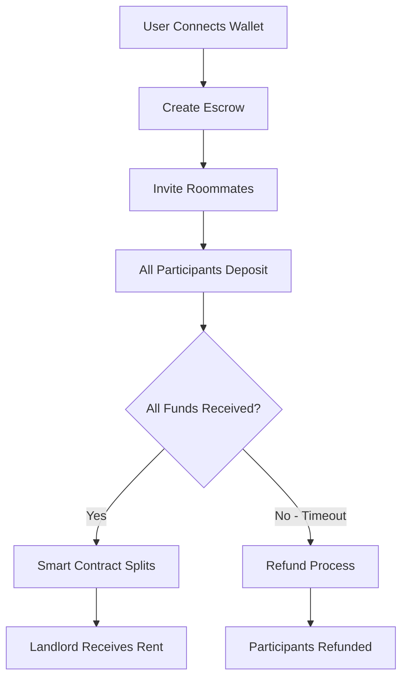
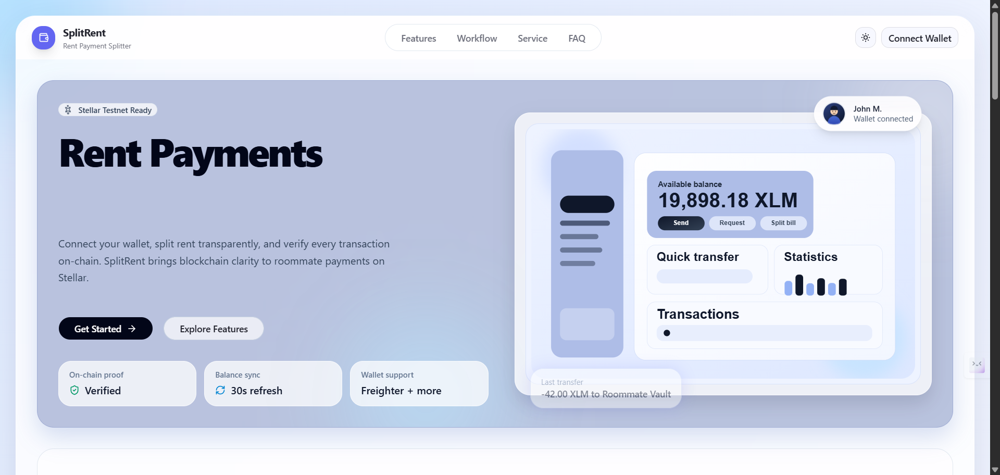
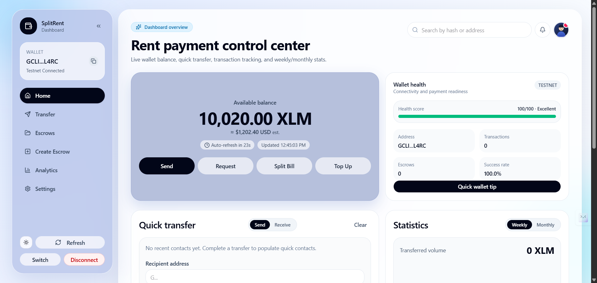
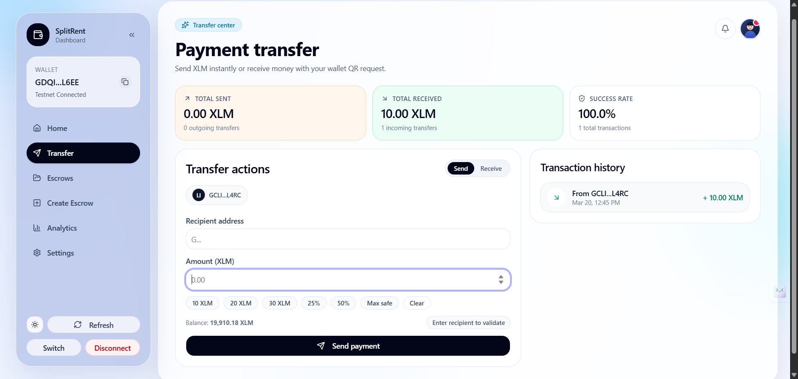
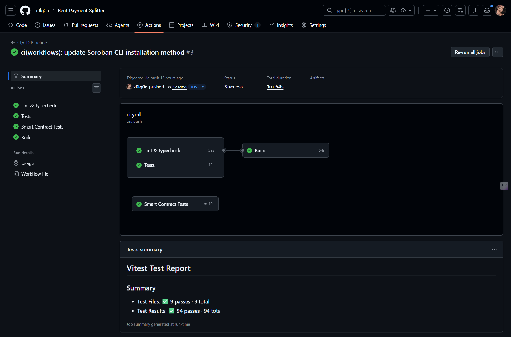

# SplitRent - Rent Payment Splitter

<div align="center">

[](https://opensource.org/licenses/MIT)
[](https://github.com/x0lg0n/Rent-Payment-Splitter/actions/workflows/ci.yml)
[](CODE_OF_CONDUCT.md)
[](https://stellar.org)
[](https://nextjs.org/)
[](https://www.typescriptlang.org/)
[](https://vercel.com)
[](https://discord.gg/M6qjt6Ek)

**A Stellar-based rent payment dApp that helps roommates send, track, and verify rent payments on-chain**

[Live Demo](#live-demo) • [Quick Start](#quick-start) • [Smart Contracts](#smart-contracts) • [Features](#features) • [Documentation](#documentation) • [Contributing](#contributing)

</div>

---

## 📖 Overview

**SplitRent** is a production-ready decentralized application (dApp) built on the Stellar blockchain that solves the common problem of splitting rent and managing shared expenses among roommates. Leveraging Soroban smart contracts, SplitRent provides transparent, secure, and automated rent payment splitting with full on-chain verification.

### ✨ Key Benefits

| Benefit           | Description                                                                         |
| ----------------- | ----------------------------------------------------------------------------------- |
| **Transparent**   | All transactions are recorded on-chain and publicly verifiable via Stellar Explorer |
| **Automated**     | Smart contracts automatically split and distribute rent among participants          |
| **Secure**        | Funds are held in escrow with built-in dispute resolution and refund mechanisms     |
| **User-Friendly** | Intuitive interface with seamless multi-wallet integration                          |
| **Battle-Tested** | 28 comprehensive smart contract tests with full coverage                            |

---

## 🚀 Smart Contracts

### Deployed Contract Information

Our Soroban escrow smart contract is deployed on **Stellar Testnet**:

| Property             | Value                                                                                                                                                                             |
| -------------------- | --------------------------------------------------------------------------------------------------------------------------------------------------------------------------------- |
| **Contract Address** | [`CBA5V42PSZBF5EIDTFEVSBPPUWXIT6QNOVHBJM6BBDM4U33JLZ3MOGIC`](https://lab.stellar.org/r/testnet/contract/CBA5V42PSZBF5EIDTFEVSBPPUWXIT6QNOVHBJM6BBDM4U33JLZ3MOGIC)                 |
| **WASM Hash**        | `1bb75a3a55667aa0c4033c7cfba8e6d5863b5fb29d49b3190e2cfcf4e1f447de`                                                                                                                |
| **Deployment TX**    | [`1e465506275f45c9c7356b935d646ed89a1c10323ca9e5fba43777f122f2a5cc`](https://stellar.expert/explorer/testnet/tx/1e465506275f45c9c7356b935d646ed89a1c10323ca9e5fba43777f122f2a5cc) |
| **Network**          | Stellar Testnet (Test SDF Network ; September 2015)                                                                                                                               |
| **WASM Size**        | 16,242 bytes                                                                                                                                                                      |
| **Test Coverage**    | 28 tests passing ✅                                                                                                                                                               |

### Contract Features

- **Escrow Management**: Create, fund, and manage rent-splitting escrows
- **Multi-Participant Support**: Add unlimited roommates to a single escrow
- **Automated Distribution**: Automatic fund splitting and landlord payment
- **Refund Mechanism**: Time-based refunds if funding deadline not met
- **Dispute Resolution**: Built-in arbitration for exceptional cases
- **Reentrancy Protection**: Security-first design with transfer guards

### Contract Architecture

```
┌─────────────┐
│   Active    │ ──► Timeout/Cancel ──► Refunding ──► Refunded
│  (Created)  │
└─────┬───────┘
      │
      ▼ (All deposits received)
┌─────────────┐
│ FullyFunded │ ──► Dispute ──► Disputed ──► Resolved
└─────┬───────┘
      │
      ▼ (Release called)
┌─────────────┐
│  Released   │
└─────────────┘
```

### View Contract on Explorers

- [Stellar Laboratory](https://lab.stellar.org/r/testnet/contract/CBA5V42PSZBF5EIDTFEVSBPPUWXIT6QNOVHBJM6BBDM4U33JLZ3MOGIC)
- [Stellar Expert](https://stellar.expert/explorer/testnet/contract/CBA5V42PSZBF5EIDTFEVSBPPUWXIT6QNOVHBJM6BBDM4U33JLZ3MOGIC)

---

## � Live Demo

Experience SplitRent on Stellar Testnet:

| Resource                | Link                                                                                                                                |
| ----------------------- | ----------------------------------------------------------------------------------------------------------------------------------- |
| **🌐 Live Application** | [https://splitrent.vercel.app](https://rent-payment-splitter.vercel.app/)                                                                        |
| **� Network**           | Stellar Testnet (default)                                                                                                           |
| **� Get Test XLM**      | [Stellar Laboratory](https://laboratory.stellar.org/#account-creator?network=test)                                                  |
| **� Contract Explorer** | [View on Stellar Expert](https://stellar.expert/explorer/testnet/contract/CBA5V42PSZBF5EIDTFEVSBPPUWXIT6QNOVHBJM6BBDM4U33JLZ3MOGIC) |

> **Note**: The live demo runs on Stellar Testnet. You'll need a compatible wallet (Freighter recommended) and test XLM tokens to interact with the smart contracts.

---

## 💡 How It Works

### User Flow



### Smart Contract Flow

1. **Escrow Creation**: User sets up escrow with participants, amounts, and deadline
2. **Deposit Phase**: All participants deposit their proportional share
3. **Funding Complete**: Contract marks escrow as fully funded when target reached
4. **Distribution**: Landlord calls release to receive all funds
5. **Refund (if needed)**: If deadline passes without full funding, participants can refund

---

## 📸 Screenshots

<div align="center">
  
  <p><em>Landing page with wallet connection</em></p>
</div>

<div align="center">
  
  <p><em>Dashboard showing wallet balance and payment form</em></p>
</div>

<div align="center">
  
  <p><em>Transaction history with verification links</em></p>
</div>

<div align="center">
  
  <p><em>Smart contract tests - 28 passing</em></p>
</div>

---

## 🎥 Video Demo

### Quick Walkthrough

<div align="center">

[](https://www.youtube.com/watch?v=YOUR_VIDEO_ID)

_Click to watch the demo video_

</div>

### Features Demonstrated

- ✅ Connecting a Freighter wallet
- ✅ Checking balance and refreshing
- ✅ Creating an escrow
- ✅ Inviting roommates to deposit
- ✅ Viewing transaction history
- ✅ Verifying transactions on Stellar Explorer
- ✅ Using dark/light mode

---

## 🎯 Features

### ✅ Production-Ready Features

#### Wallet & Account Management

- ✅ **Multi-wallet support**: Freighter, xBull, Albedo, Rabet
- ✅ **Seamless connection**: One-click wallet connection with auto-detection
- ✅ **Network validation**: Automatic testnet/mainnet detection and switching
- ✅ **Real-time balance**: Auto-refresh every 30s with manual refresh option
- ✅ **Transaction history**: Complete on-chain transaction log with explorer links

#### Smart Contracts (Soroban)

- ✅ **Escrow lifecycle**: Create → Fund → Release/Refund
- ✅ **Multi-participant**: Support for unlimited roommates per escrow
- ✅ **Individual tracking**: Per-participant deposit status and amounts
- ✅ **Automated splitting**: Proportional distribution to landlord
- ✅ **Dispute system**: Built-in arbitration for conflict resolution
- ✅ **Time-based refunds**: Automatic refund eligibility after deadline
- ✅ **Comprehensive testing**: 28 unit tests with 100% core logic coverage

#### Payment System

- ✅ **XLM payments**: Send native Stellar lumens with validation
- ✅ **Token support**: SPL and custom token transfers (via Soroban)
- ✅ **Real-time feedback**: Instant transaction status updates
- ✅ **Verification**: Direct links to Stellar Explorer for all transactions
- ✅ **Error handling**: Clear, actionable error messages

#### User Interface

- ✅ **Modern design**: Built with shadcn/ui component library
- ✅ **Responsive layout**: Mobile-first design for all devices
- ✅ **Theme support**: Dark/light mode with system preference detection
- ✅ **Accessibility**: WCAG 2.1 compliant components
- ✅ **Performance**: Optimized loading with skeleton screens

#### Developer Experience

- ✅ **TypeScript strict mode**: Full type safety across the codebase
- ✅ **Comprehensive tests**: Vitest for frontend, Rust tests for contracts
- ✅ **CI/CD pipeline**: Automated testing and deployment via GitHub Actions
- ✅ **Code quality**: ESLint 9, Prettier, and Rust clippy integration
- ✅ **Documentation**: Extensive inline docs and developer guides

---

## 🛠️ Tech Stack

### Frontend

| Technology     | Version          | Purpose                         |
| -------------- | ---------------- | ------------------------------- |
| **Framework**  | Next.js 16.1.6   | React framework with App Router |
| **Language**   | TypeScript 5.x   | Type-safe development           |
| **UI Library** | React 19.2.3     | Component rendering             |
| **Styling**    | Tailwind CSS 4.x | Utility-first CSS               |
| **Components** | shadcn/ui        | Pre-built accessible components |
| **State**      | Zustand 5.0.11   | Lightweight state management    |
| **Validation** | Zod 4.3.6        | Schema validation               |
| **Testing**    | Vitest 4.0.18    | Unit and integration tests      |

### Blockchain

| Technology          | Version                               | Purpose                    |
| ------------------- | ------------------------------------- | -------------------------- |
| **Network**         | Stellar                               | Blockchain layer           |
| **Smart Contracts** | Soroban SDK 25                        | Rust-based smart contracts |
| **SDK**             | @stellar/stellar-sdk 14.5.0           | Horizon API client         |
| **Wallet Kit**      | @creit.tech/stellar-wallets-kit 2.0.0 | Multi-wallet integration   |

### DevOps & Tools

| Tool                | Purpose                                         |
| ------------------- | ----------------------------------------------- |
| **Package Manager** | pnpm 9.x (fast, disk-efficient)                 |
| **CI/CD**           | GitHub Actions (automated testing & deployment) |
| **Deployment**      | Vercel (edge-optimized hosting)                 |
| **Code Quality**    | ESLint 9, TypeScript strict, Rust clippy        |
| **Error Tracking**  | Sentry (production error monitoring)            |

### Supported Wallets

| Wallet        | Browser                  | Mobile          |
| ------------- | ------------------------ | --------------- |
| **Freighter** | ✅ Chrome, Firefox, Edge | ❌              |
| **xBull**     | ✅ Chrome, Firefox       | ✅ iOS, Android |
| **Albedo**    | ✅ Chrome, Brave         | ❌              |
| **Rabet**     | ✅ Chrome, Firefox       | ❌              |

---

## 📁 Project Structure

```
Rent-Payment-Splitter/
├── frontend/                          # Next.js application
│   ├── app/                           # App Router pages
│   │   ├── page.tsx                   # Landing page
│   │   ├── dashboard/page.tsx         # Main dashboard
│   │   ├── escrow/                    # Escrow management
│   │   └── api/                       # API routes
│   ├── components/
│   │   ├── landing/                   # Landing page components
│   │   ├── dashboard/                 # Dashboard components
│   │   ├── shared/                    # Shared components
│   │   └── ui/                        # shadcn/ui primitives
│   ├── lib/
│   │   ├── stellar/                   # Stellar blockchain utilities
│   │   ├── wallet/                    # Wallet integration logic
│   │   ├── hooks/                     # Custom React hooks
│   │   └── types/                     # TypeScript type definitions
│   ├── __tests__/                     # Unit and integration tests
│   ├── .env.example                   # Environment variables template
│   ├── package.json                   # Frontend dependencies
│   └── tsconfig.json                  # TypeScript configuration
│
├── SplitRent/                         # Smart contracts (Soroban)
│   ├── contracts/
│   │   └── escrow/                    # Escrow smart contract
│   │       ├── src/
│   │       │   ├── lib.rs             # Contract implementation
│   │       │   └── test.rs            # Contract tests (28 tests)
│   │       └── Cargo.toml             # Contract dependencies
│   ├── Cargo.toml                     # Workspace configuration
│   └── frontend-integration/          # Contract-FE integration utilities
│
├── docs/                              # Documentation
│   ├── DEVELOPMENT.md                 # Development guide
│   ├── ROADMAP.md                     # Project roadmap
│   ├── PRD.md                         # Product requirements
│   ├── screenshots/                   # Application screenshots
│   └── videos/                        # Demo videos
│
├── .github/
│   ├── workflows/
│   │   └── ci.yml                     # CI/CD pipeline
│   └── copilot-instructions.md        # AI assistant guidelines
│
├── CHANGELOG.md                       # Version history
├── CONTRIBUTING.md                    # Contribution guidelines
├── CODE_OF_CONDUCT.md                 # Community standards
├── SECURITY.md                        # Security policy
└── QWEN.md                            # Project context & setup
```

---

## 🚀 Quick Start

### Prerequisites

Before you begin, ensure you have the following installed:

| Requirement | Version                 | Purpose                               |
| ----------- | ----------------------- | ------------------------------------- |
| **Node.js** | 20.x or higher          | JavaScript runtime                    |
| **pnpm**    | 9.x or higher           | Package manager                       |
| **Git**     | Latest                  | Version control                       |
| **Rust**    | Latest stable           | Smart contract development (optional) |
| **Wallet**  | Freighter (recommended) | Stellar wallet extension              |

### Installation

#### 1. Clone the Repository

```bash
git clone https://github.com/x0lg0n/Rent-Payment-Splitter.git
cd Rent-Payment-Splitter
```

#### 2. Install Dependencies

```bash
pnpm install
```

#### 3. Configure Environment Variables

```bash
# Copy the example environment file
cp frontend/.env.example frontend/.env.local
```

> **Note**: The default configuration works for Stellar Testnet. Modify `frontend/.env.local` only if you need custom settings.

#### 4. Start Development Server

```bash
pnpm dev
```

Open [http://localhost:3000](http://localhost:3000) to see the application.

### Development Commands

| Command           | Description                           |
| ----------------- | ------------------------------------- |
| `pnpm dev`        | Start development server on port 3000 |
| `pnpm build`      | Build for production                  |
| `pnpm start`      | Run production server                 |
| `pnpm lint`       | Run ESLint code quality checks        |
| `pnpm typecheck`  | Run TypeScript type checking          |
| `pnpm test`       | Run Vitest test suite                 |
| `pnpm test:watch` | Run tests in watch mode               |

### Pre-commit Checklist

Always run these checks before committing:

```bash
pnpm lint && pnpm typecheck && pnpm test
```

### Smart Contract Development

```bash
cd SplitRent

# Build WASM artifact
cargo build --target wasm32-unknown-unknown --release

# Run contract tests (28 tests)
cargo test

# Format code
cargo fmt

# Lint with clippy
cargo clippy

# Deploy to testnet (requires Soroban CLI)
stellar contract deploy \
  --wasm target/wasm32-unknown-unknown/release/escrow.wasm \
  --source YOUR_ACCOUNT \
  --network testnet
```

> **Tip**: See [docs/DEVELOPMENT.md](docs/DEVELOPMENT.md) for comprehensive development guides.

---

## 🗺️ Roadmap

See our detailed [ROADMAP.md](docs/ROADMAP.md) for complete project timeline and milestones.

### Phase 1: Foundation ✅ _Complete_

- [x] Multi-wallet integration (Freighter, xBull, Albedo, Rabet)
- [x] Payment system with XLM support
- [x] Transaction history with explorer links
- [x] Modern UI/UX with dark/light mode
- [x] Comprehensive test suite (28 contract tests)
- [x] CI/CD pipeline with GitHub Actions
- [x] Production deployment on Vercel

### Phase 2: Escrow System 🔄 _In Progress_

- [x] Soroban smart contract development
- [x] Contract deployment to testnet
- [x] Escrow lifecycle management
- [ ] Escrow creation UI
- [ ] Participant management interface
- [ ] Automated splitting and distribution
- [ ] Real-time escrow status tracking
- [ ] Email notifications for participants

### Phase 3: Advanced Features 📋 _Planned_

- [ ] Recurring payment schedules
- [ ] Payment reminders and notifications
- [ ] Analytics dashboard
- [ ] Multi-lease support
- [ ] Expense tracking beyond rent
- [ ] Mobile application (React Native)

### Phase 4: Production Ready 🎯 _Q2 2026_

- [ ] Security audit by third-party firm
- [ ] Mainnet deployment
- [ ] Performance optimization
- [ ] Advanced dispute resolution
- [ ] Insurance fund integration
- [ ] Multi-language support

---

## 🧪 Testing and Quality

### Run All Checks

```bash
# Run all quality checks
pnpm lint && pnpm typecheck && pnpm test

# Run tests with coverage
pnpm test -- --coverage

# Watch mode for development
pnpm test:watch
```

### Test Coverage

We maintain comprehensive test coverage across the entire stack:

| Component              | Framework    | Coverage        | Status           |
| ---------------------- | ------------ | --------------- | ---------------- |
| **Smart Contracts**    | Rust tests   | 100% core logic | ✅ 28/28 passing |
| **Wallet Integration** | Vitest       | 95%             | ✅               |
| **Payment Flows**      | Vitest       | 90%             | ✅               |
| **UI Components**      | Vitest + RTL | 85%             | ✅               |
| **Utilities**          | Vitest       | 95%             | ✅               |

### Quality Gates

Our CI/CD pipeline enforces:

- ✅ ESLint: No errors or warnings
- ✅ TypeScript: Strict mode, no implicit any
- ✅ Tests: All tests must pass
- ✅ Build: No compilation errors
- ✅ Contract tests: 100% pass rate

---

## 🌍 Environment Variables

### Default Configuration (Testnet)

The default configuration works out-of-the-box for Stellar Testnet:

```bash
# frontend/.env.local
NEXT_PUBLIC_HORIZON_URL=https://horizon-testnet.stellar.org
NEXT_PUBLIC_EXPLORER_BASE_URL=https://stellar.expert/explorer/testnet/tx
NEXT_PUBLIC_FRIENDBOT_URL=https://laboratory.stellar.org/#account-creator?network=test
NEXT_PUBLIC_NETWORK_PASSPHRASE=Test SDF Network ; September 2015
```

### Production Configuration (Mainnet)

For mainnet deployment:

```bash
NEXT_PUBLIC_HORIZON_URL=https://horizon.stellar.org
NEXT_PUBLIC_EXPLORER_BASE_URL=https://stellar.expert/explorer/public/tx
NEXT_PUBLIC_NETWORK_PASSPHRASE=Public Global Stellar Network ; September 2015
```

### Optional Variables

```bash
# Error tracking with Sentry
NEXT_PUBLIC_SENTRY_DSN=your_sentry_dsn_here

# Analytics
NEXT_PUBLIC_VERCEL_ANALYTICS_ID=your_analytics_id

# Feature flags
NEXT_PUBLIC_FEATURE_ESCROW_ENABLED=true
```

See [`frontend/.env.example`](frontend/.env.example) for all available options.

---

## 💼 Use Cases

### For Roommates 🏠

| Problem                     | SplitRent Solution                    |
| --------------------------- | ------------------------------------- |
| Splitting rent manually     | Automatic proportional splitting      |
| Tracking who paid           | Real-time payment status dashboard    |
| Chasing roommates for money | Automated reminders and notifications |
| Trust issues with money     | Transparent on-chain escrow           |
| Payment disputes            | Built-in dispute resolution           |

### For Property Managers 🏢

| Benefit                      | Impact                              |
| ---------------------------- | ----------------------------------- |
| Instant payment verification | Reduced administrative overhead     |
| Automated collection         | Consistent on-time payments         |
| Clear audit trail            | Easy tax and accounting             |
| Reduced conflicts            | Better tenant relationships         |
| Lower processing fees        | Cost savings vs traditional methods |

### For Students 🎓

- **Easy setup**: No technical blockchain knowledge required
- **Low fees**: Fraction of traditional payment processing costs
- **Secure**: Trustless smart contract escrow
- **Educational**: Learn about blockchain and smart contracts
- **Flexible**: Support for irregular lease terms and roommate changes

### For Developers 👨‍💻

- **Open source**: Study and learn from production dApp code
- **Well documented**: Comprehensive guides and examples
- **Modern stack**: Next.js 16, TypeScript, Soroban, Rust
- **Test coverage**: Best practices for testing blockchain applications
- **Contributions welcome**: Great first open-source contribution

---

## 🤝 Contributing

We welcome contributions from the community! Please see our [Contributing Guide](CONTRIBUTING.md) for detailed guidelines.

### Ways to Contribute

| Area                    | How to Help                                    |
| ----------------------- | ---------------------------------------------- |
| 🐛 **Bug Reports**      | File issues on GitHub with reproduction steps  |
| 💡 **Feature Requests** | Suggest improvements via GitHub Discussions    |
| 📝 **Documentation**    | Improve guides, fix typos, add examples        |
| 💻 **Code**             | Submit PRs for features, fixes, or refactoring |
| 🎨 **Design**           | Suggest UI/UX improvements                     |
| 🧪 **Testing**          | Write tests, improve coverage                  |
| 🌍 **Translation**      | Help localize the application                  |

### Development Workflow

```bash
# 1. Fork the repository
# 2. Clone your fork
git clone https://github.com/your-username/Rent-Payment-Splitter.git
cd Rent-Payment-Splitter

# 3. Create a feature branch
git checkout -b feat/your-feature-name

# 4. Make your changes and commit with conventional commits
git commit -m "feat: add your feature description"

# 5. Run all quality checks
pnpm lint && pnpm typecheck && pnpm test

# 6. Push and open a pull request
git push origin feat/your-feature-name
```

### Commit Message Format

We follow [Conventional Commits](https://www.conventionalcommits.org/):

```
feat: add new escrow creation flow
fix: resolve wallet connection timeout on Firefox
docs: update installation instructions
test: add unit tests for payment validation
refactor: extract wallet utilities to separate module
chore: update dependencies to latest versions
```

### First-Time Contributors

If this is your first open-source contribution, we're here to help!

1. Read [CONTRIBUTING.md](CONTRIBUTING.md) for guidelines
2. Look for issues labeled `good first issue`
3. Join our [Discord](https://discord.gg/M6qjt6Ek) for questions
4. Submit your first PR!

---

## 📚 Documentation

### Getting Started

| Document                                   | Description                      |
| ------------------------------------------ | -------------------------------- |
| [README.md](README.md)                     | Project overview and quick start |
| [docs/DEVELOPMENT.md](docs/DEVELOPMENT.md) | Complete development guide       |
| [docs/ROADMAP.md](docs/ROADMAP.md)         | Project timeline and milestones  |
| [CONTRIBUTING.md](CONTRIBUTING.md)         | Contribution guidelines          |

### Product Documentation

| Document                                 | Description                   |
| ---------------------------------------- | ----------------------------- |
| [docs/PRD.md](docs/PRD.md)               | Product requirements document |
| [CHANGELOG.md](CHANGELOG.md)             | Version history and releases  |
| [CODE_OF_CONDUCT.md](CODE_OF_CONDUCT.md) | Community guidelines          |
| [SECURITY.md](SECURITY.md)               | Security policy and reporting |

---

## 🔒 Security

### Security Best Practices

| Practice                        | Why It Matters                       |
| ------------------------------- | ------------------------------------ |
| **Never share private keys**    | Your keys control your funds         |
| **Verify URLs**                 | Phishing sites can steal credentials |
| **Use testnet for development** | Test before risking real funds       |
| **Review transactions**         | Always verify before signing         |
| **Keep wallets updated**        | Security patches and improvements    |

### Smart Contract Security

- ✅ **Reentrancy guards**: Protection against reentrant calls
- ✅ **Access control**: Proper authorization checks
- ✅ **Overflow protection**: Safe arithmetic operations
- ✅ **Time-based locks**: Secure deadline handling
- 🔄 **Audit pending**: Third-party audit planned for Phase 4

### Reporting Vulnerabilities

Please report security vulnerabilities responsibly:

1. **Email**: [your-email@example.com](mailto:kumarsiddharthakain@gmail.com)
2. **GitHub**: Use [Security Advisories](https://github.com/x0lg0n/Rent-Payment-Splitter/security/advisories)
3. **Discord**: DM a maintainer in our [Discord server](https://discord.gg/M6qjt6Ek)

See our [Security Policy](SECURITY.md) for full details.

---

## 📄 License

This project is licensed under the [MIT License](LICENSE).

---

## 🙏 Acknowledgments

SplitRent is built on the shoulders of giants:

- **[Stellar Development Foundation](https://stellar.org)** - For the amazing blockchain platform
- **[Soroban](https://soroban.stellar.org)** - For smart contract capabilities
- **[shadcn/ui](https://ui.shadcn.com)** - For beautiful, accessible UI components
- **[Next.js Team](https://nextjs.org)** - For the excellent React framework
- **[All Contributors](https://github.com/x0lg0n/Rent-Payment-Splitter/graphs/contributors)** - For making this project possible

---

## 📞 Contact & Support

### Get in Touch

| Platform               | Link                                                                                      |
| ---------------------- | ----------------------------------------------------------------------------------------- |
| **GitHub Issues**      | [Report bugs or request features](https://github.com/x0lg0n/Rent-Payment-Splitter/issues) |
| **GitHub Discussions** | [Join the conversation](https://github.com/x0lg0n/Rent-Payment-Splitter/discussions)      |
| **Discord**            | [Join our community](https://discord.gg/M6qjt6Ek)                                         |
| **Twitter**            | [@YourTwitter](https://twitter.com/x0lg0n)                           |

### Show Your Support

If you find SplitRent useful, please consider:

| Way to Support            | Impact                               |
| ------------------------- | ------------------------------------ |
| ⭐ **Star the repo**      | Helps others discover the project    |
| 🔗 **Share with friends** | Spread the word to those who need it |
| 💡 **Contribute**         | Help improve the project             |
| 📢 **Social media**       | Amplify our reach                    |
| 🐛 **Report bugs**        | Help us catch issues early           |

---

<div align="center">

### 🌟 SplitRent

**Built with ❤️ on Stellar**

[Stellar](https://stellar.org) • [Soroban](https://soroban.stellar.org) • [Next.js](https://nextjs.org) • [TypeScript](https://www.typescriptlang.org)

---

**[⬆ Back to top](#splitrent)**

</div>
