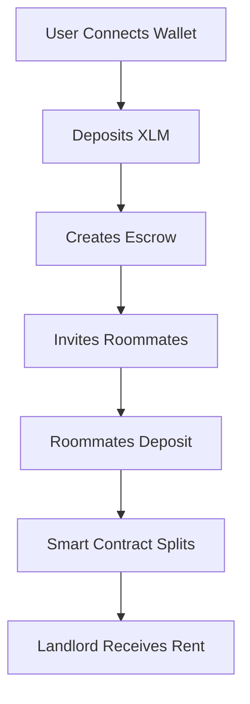

# SplitRent

<div align="center">

[](https://opensource.org/licenses/MIT)
[](https://github.com/x0lg0n/Rent-Payment-Splitter/actions/workflows/ci.yml)
[](CODE_OF_CONDUCT.md)
[](https://stellar.org)
[](https://nextjs.org/)
[](https://www.typescriptlang.org/)
<!-- Optional badges for future -->
<!-- [](https://codecov.io/gh/x0lg0n/Rent-Payment-Splitter) -->
<!-- [](https://vercel.com) -->
<!-- [](https://discord.gg/your-invite) -->

**A Stellar-based rent payment dApp that helps roommates send, track, and verify rent payments on-chain**

[Features](#features) • [Live Demo](#live-demo) • [Screenshots](#screenshots) • [How It Works](#how-it-works) • [Roadmap](#roadmap) • [Tech Stack](#tech-stack) • [Quick Start](#quick-start)

</div>

---

## 📖 Overview

SplitRent solves the common problem of splitting rent and managing shared expenses among roommates. Built on Stellar blockchain, it provides transparent, secure, and automated rent payment splitting using smart contracts (Soroban).

### ✨ Key Benefits

- **Transparent**: All transactions are on-chain and verifiable
- **Automated**: Automatic rent splitting among roommates
- **Secure**: Smart contract escrow ensures funds are protected
- **User-Friendly**: Clean, modern interface with wallet integration
- **Testnet Ready**: Fully functional on Stellar testnet

---

## 🎯 What's Built & Working Now

### ✅ Completed Features

#### Wallet & Account Management
- ✅ Multi-wallet support (Freighter, xBull, Albedo, Rabet)
- ✅ Seamless wallet connection and switching
- ✅ Wallet status detection and network validation
- ✅ Balance display with auto-refresh (30s intervals)
- ✅ Manual balance refresh functionality

#### Smart Contracts (Soroban)
- ✅ Escrow contract with full test coverage (28 tests passing)
- ✅ Create, deposit, release, refund functionality
- ✅ Dispute resolution system
- ✅ Multi-participant support
- ✅ Automated payment distribution
- ✅ WASM build: 16,242 bytes

#### Payment System
- ✅ Send XLM payments with validation
- ✅ Real-time transaction feedback
- ✅ Transaction history with detailed view
- ✅ Direct links to Stellar Explorer for verification
- ✅ Clear error and success notifications

#### User Interface
- ✅ Modern, responsive design with shadcn/ui components
- ✅ Dark/light mode theme toggle
- ✅ Landing page with features and FAQ
- ✅ Dashboard with comprehensive wallet management
- ✅ Onboarding checklist with progress tracking
- ✅ Mobile-responsive layout

#### Developer Experience
- ✅ Comprehensive test suite with Vitest
- ✅ ESLint and TypeScript type checking
- ✅ GitHub Actions CI/CD pipeline
- ✅ Well-documented codebase
- ✅ Environment configuration management

---

## 🚧 Currently Under Development

We're actively working on these features:

### Escrow System (In Progress)
- 🔄 Soroban smart contract for escrow management
- 🔄 Create and manage rent-splitting escrows
- 🔄 Multi-participant support
- 🔄 Automated payment distribution
- 🔄 Real-time escrow status tracking
- 🔄 Participant contribution monitoring

### Enhanced Features
- 🔄 Improved multi-wallet UX
- 🔄 Escrow timeline visualization
- 🔄 Payment scheduling and reminders
- 🔄 Advanced transaction filtering

---

## 📸 Screenshots

<div align="center">
  
  <p><em>Landing page with wallet connection</em></p>
</div>

<div align="center">
  
  <p><em>Dashboard showing wallet balance and payment form</em></p>
</div>

<div align="center">
  
  <p><em>Transaction history with verification links</em></p>
</div>

<div align="center">
  
  <p><em>Dark mode interface</em></p>
</div>

> 📷 **Note**: Add your screenshots to `docs/screenshots/` directory. See [docs/screenshots/README.md](docs/screenshots/README.md) for guidelines.

---

## 🎥 Video Demo

### Quick Walkthrough

<div align="center">

[](https://www.youtube.com/watch?v=YOUR_VIDEO_ID)

*Click to watch the demo video*

</div>

### Features Demonstrated

- Connecting a Freighter wallet
- Checking balance and refreshing
- Sending a payment
- Viewing transaction history
- Verifying transactions on Stellar Explorer
- Using dark/light mode

> 🎬 **Note**: Replace with your actual demo video link or save video file to `docs/videos/demo.mp4`. See [docs/videos/README.md](docs/videos/README.md) for guidelines.

---

## 🔗 Live Demo

Experience SplitRent on Stellar Testnet:

- **🌐 Live URL**: [https://splitrent.vercel.app](https://splitrent.vercel.app) (when deployed)
- **🔗 Testnet**: Uses Stellar Testnet by default
- **💰 Get Test XLM**: [Stellar Laboratory](https://laboratory.stellar.org/#account-creator?network=test)

---

## 💡 How It Works

### Basic Flow



### Smart Contract Architecture

1. **Escrow Creation**: User sets up escrow with participants and amounts
2. **Deposit Phase**: All participants deposit their share
3. **Distribution**: Contract automatically splits and distributes funds
4. **Verification**: All transactions recorded on Stellar blockchain

---

## 🛠️ Tech Stack

### Frontend
- **Framework**: Next.js 16.1.6 (App Router)
- **Language**: TypeScript 5.x
- **UI Library**: React 19.2.3
- **Styling**: Tailwind CSS 4.x
- **Components**: shadcn/ui
- **Testing**: Vitest 4.0.18

### Blockchain
- **Network**: Stellar (Testnet/Mainnet)
- **Smart Contracts**: Soroban (Rust)
- **SDK**: @stellar/stellar-sdk 14.5.0
- **Wallet Integration**: @creit.tech/stellar-wallets-kit 2.0.0

stellar contract deploy \
  --wasm target/wasm32v1-none/release/escrow.wasm \
  --source-account escrow \
  --network testnet \
  --alias escrow_contracts
ℹ️  Simulating install transaction…
ℹ️  Signing transaction: 9d395437999bbd034731f3cbe6a2be5c5b1b8148ff70d289e65b28e933b2ac10
🌎 Submitting install transaction…
ℹ️  Using wasm hash 1bb75a3a55667aa0c4033c7cfba8e6d5863b5fb29d49b3190e2cfcf4e1f447de
ℹ️  Simulating deploy transaction…
ℹ️  Transaction hash is 1e465506275f45c9c7356b935d646ed89a1c10323ca9e5fba43777f122f2a5cc
🔗 https://stellar.expert/explorer/testnet/tx/1e465506275f45c9c7356b935d646ed89a1c10323ca9e5fba43777f122f2a5cc
ℹ️  Signing transaction: 1e465506275f45c9c7356b935d646ed89a1c10323ca9e5fba43777f122f2a5cc
🌎 Submitting deploy transaction…
🔗 https://lab.stellar.org/r/testnet/contract/CBA5V42PSZBF5EIDTFEVSBPPUWXIT6QNOVHBJM6BBDM4U33JLZ3MOGIC
✅ Deployed!
CBA5V42PSZBF5EIDTFEVSBPPUWXIT6QNOVHBJM6BBDM4U33JLZ3MOGIC

### Supported Wallets
- Freighter
- xBull
- Albedo
- Rabet

### DevOps & Tools
- **Package Manager**: pnpm 9.x
- **CI/CD**: GitHub Actions
- **Deployment**: Vercel
- **Code Quality**: ESLint, TypeScript

---

## 📁 Project Structure

```
Rent Payment Splitter/
├── frontend/
│   ├── app/                      # Next.js App Router pages
│   │   ├── page.tsx              # Landing page
│   │   └── dashboard/page.tsx    # Dashboard
│   ├── components/
│   │   ├── landing/              # Landing page components
│   │   ├── dashboard/            # Dashboard components
│   │   ├── shared/               # Shared components
│   │   └── ui/                   # UI primitives
│   ├── lib/
│   │   ├── stellar/              # Stellar utilities
│   │   ├── wallet/               # Wallet integration
│   │   ├── hooks/                # React hooks
│   │   └── types/                # TypeScript types
│   └── __tests__/                # Unit tests
├── SplitRent/
│   └── contracts/escrow/         # Soroban smart contracts
│       ├── src/
│       │   ├── lib.rs            # Contract logic
│       │   └── test.rs           # Contract tests
│       └── Cargo.toml
├── docs/
│   ├── screenshots/              # App screenshots
│   ├── videos/                   # Demo videos
│   ├── PRD.md                    # Product requirements
│   ├── ROADMAP.md                # Project roadmap
│   └── DEVELOPMENT.md            # Development guide
└── .github/
    └── workflows/                # CI/CD pipelines
```

---

## 🚀 Quick Start

### Prerequisites

- Node.js 20.x or higher
- pnpm 9.x or higher
- Git
- A Stellar wallet (Freighter recommended)

### Installation

```bash
# Clone the repository
git clone https://github.com/x0lg0n/Rent-Payment-Splitter.git
cd Rent-Payment-Splitter

# Install dependencies
pnpm install

# Set up environment variables
cp frontend/.env.example frontend/.env.local

# Start development server
pnpm dev
```

Open [http://localhost:3000](http://localhost:3000) to see the application.

### Available Scripts

```bash
pnpm dev          # Start development server
pnpm build        # Build for production
pnpm start        # Run production server
pnpm lint         # Run ESLint
pnpm typecheck    # Run TypeScript type check
pnpm test         # Run Vitest tests
pnpm test:watch   # Run tests in watch mode
```

### Smart Contract Development

```bash
cd SplitRent

# Build contracts
cargo build --target wasm32-unknown-unknown --release

# Run contract tests
cargo test

# Deploy to testnet (requires Soroban CLI)
stellar contract deploy --wasm target/wasm32-unknown-unknown/release/escrow.wasm --source YOUR_ACCOUNT --network testnet
```

---

## 🗺️ Roadmap

See our detailed [ROADMAP.md](docs/ROADMAP.md) for complete project timeline.

### Phase 1: Foundation ✅
- [x] Wallet integration
- [x] Payment system
- [x] Transaction history
- [x] Modern UI/UX

### Phase 2: Escrow (Current)
- [ ] Smart contract deployment
- [ ] Escrow creation UI
- [ ] Participant management
- [ ] Automated splitting

### Phase 3: Advanced Features
- [ ] Recurring payments
- [ ] Payment scheduling
- [ ] Notifications
- [ ] Analytics dashboard

### Phase 4: Production
- [ ] Security audit
- [ ] Mainnet deployment
- [ ] Performance optimization
- [ ] Mobile app

---

## 🧪 Testing and Quality

### Run All Checks

```bash
pnpm lint && pnpm typecheck && pnpm test
```

### Test Coverage

We maintain comprehensive test coverage for:
- Wallet connection flows
- Payment transactions
- UI components
- Utility functions
- Smart contracts

---

## 🌍 Environment Variables

Default configuration works for testnet. Optional overrides:

```bash
NEXT_PUBLIC_HORIZON_URL=https://horizon-testnet.stellar.org
NEXT_PUBLIC_EXPLORER_BASE_URL=https://stellar.expert/explorer/testnet/tx
NEXT_PUBLIC_FRIENDBOT_URL=https://laboratory.stellar.org/#account-creator?network=test
```

See [`frontend/.env.example`](frontend/.env.example) for all options.

---

## 💼 Use Cases

### For Roommates
- Split rent automatically each month
- Track who has paid their share
- Transparent payment history
- No more awkward conversations about money

### For Property Managers
- Verify rent payments instantly
- Automated payment collection
- Reduced administrative overhead
- Clear audit trail

### For Students
- Easy setup with no technical knowledge
- Low transaction fees on Stellar
- Secure and trustless system
- Learn about blockchain technology

---

## 🤝 Contributing

We welcome contributions! Please see our [Contributing Guide](CONTRIBUTING.md) for details.

### Ways to Contribute
- 🐛 Report bugs
- 💡 Suggest features
- 📝 Improve documentation
- 💻 Submit PRs
- 🎨 Design improvements
- 🧪 Write tests

### Development Setup

1. Fork the repository
2. Create a feature branch (`git checkout -b feat/amazing-feature`)
3. Make your changes
4. Run tests (`pnpm test`)
5. Commit with conventional commits
6. Push and open a PR

---

## 📚 Documentation

### Product & Development
- **[Product Requirements](docs/PRD.md)** - Detailed product specs
- **[Roadmap](docs/ROADMAP.md)** - Project timeline and milestones
- **[Development Guide](docs/DEVELOPMENT.md)** - Complete dev setup and workflow
- **[Tech Stack](docs/STACK.md)** - Technology recommendations
- **[Contributing Guide](CONTRIBUTING.md)** - How to contribute
- **[Code of Conduct](CODE_OF_CONDUCT.md)** - Community guidelines
- **[Security Policy](SECURITY.md)** - Reporting vulnerabilities
- **[Changelog](CHANGELOG.md)** - Version history

### Smart Contract Integration
- **[Integration Quick Start](docs/INTEGRATION-QUICKSTART.md)** - 🚀 Start here for integration
- **[Integration Plan](docs/ESCROW-INTEGRATION-PLAN.md)** - Complete integration guide
- **[Service Specification](docs/ESCROW-SERVICE-SPEC.md)** - Technical API spec
- **[Contract Source](SplitRent/contracts/escrow/src/lib.rs)** - Rust smart contract code
- **[Contract Tests](SplitRent/contracts/escrow/src/test.rs)** - Test suite (28 tests)

---

## 🔒 Security

### Security Best Practices
- Never share your private keys or seed phrases
- Always verify you're on the correct URL
- Use testnet for development and testing
- Review all transaction details before signing
- Keep your wallet extensions up to date

### Reporting Vulnerabilities

Please report security vulnerabilities responsibly via email to **[your-email@example.com]** or through GitHub Security Advisories. See our [Security Policy](SECURITY.md) for details.

---

## 📄 License

This project is licensed under the MIT License - see the [LICENSE](LICENSE) file for details.

### What This Means
- ✅ Free to use for personal and commercial projects
- ✅ Can modify and distribute
- ✅ Include original license and copyright notice
- ❌ No warranty provided

---

## 🙏 Acknowledgments

- [Stellar Development Foundation](https://stellar.org) for the amazing blockchain platform
- [Soroban](https://soroban.stellar.org) for smart contract capabilities
- [shadcn/ui](https://ui.shadcn.com) for beautiful UI components
- [Next.js team](https://nextjs.org) for the excellent framework
- All contributors and supporters of this project

---

## 📞 Contact & Support

- **GitHub Issues**: [Report bugs or request features](https://github.com/x0lg0n/Rent-Payment-Splitter/issues)
- **Discussions**: [Join the conversation](https://github.com/x0lg0n/Rent-Payment-Splitter/discussions)
- **Twitter**: [@YourTwitter](https://twitter.com/YourTwitter) (when available)
- **Discord**: [Join our Discord](https://discord.gg/your-invite) (when available)

### Show Your Support

If you find SplitRent useful, please consider:
- ⭐ Starring this repository
- 🔗 Sharing with friends who might benefit
- 💡 Contributing to the project
- 📢 Spreading the word on social media

---

<div align="center">

**Built with ❤️ on Stellar**

[Back to top](#splitrent)

</div>
